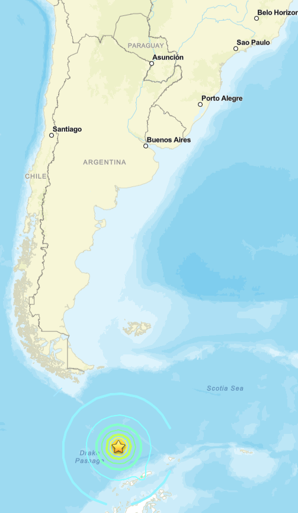

# 🌎 Detecção de TIDs Associados ao Terremoto da Argentina de 2025 Utilizando Dados GNSS e Análise de Componentes Principais (PCA)

<p align="center">
  
</p>

Este repositório reúne todos os códigos em **MATLAB**, dados processados, figuras e materiais de apoio utilizados na análise de **Distúrbios Ionosféricos Propagantes (Traveling Ionospheric Disturbances - TIDs)** associados ao **terremoto ocorrido na Argentina em 22 de agosto de 2025**, utilizando dados da rede **GNSS** distribuída pela América do Sul.

O projeto investiga as perturbações ionosféricas geradas pelo terremoto por meio de observações de **TEC (Total Electron Content)** e da técnica estatística de **Análise de Componentes Principais (PCA)**, permitindo identificar os principais padrões espaciais e temporais relacionados ao evento sísmico.

---

# 🌎 Informações do Evento

- **Evento:** Terremoto da Argentina
- **Data:** 22 de agosto de 2025
- **Magnitude:** Mw 7,0
- **Epicentro:** 60,186° S, 61,821° W
- **Fonte dos dados:** Estações GNSS (RBMC, RAMSAC, SIRGAS e redes associadas)

---

# 🚀 Objetivos

- Processar observações GNSS antes, durante e após o terremoto.
- Detectar Distúrbios Ionosféricos Propagantes (TIDs).
- Comparar condições ionosféricas perturbadas e dias calmos.
- Aplicar Análise de Componentes Principais (PCA).
- Produzir representações temporais e espaciais das perturbações.

---

# 📊 Metodologia

```text
Arquivos GNSS (.CMN / TEC)
            │
            ▼
Leitura e pré-processamento
            │
            ▼
Seleção do satélite (PRN)
Filtro de elevação (>30°)
            │
            ▼
Remoção da tendência do STEC
(Ajuste exponencial)
            │
            ▼
Filtro por média móvel
(Aproximação passa-banda)
            │
            ▼
Extração dos resíduos (TIDs)
            │
            ▼
Seleção das estações
            │
            ▼
Normalização do TEC
(VTEC − Média Mensal)
            │
            ▼
Construção da matriz
(Estações × Tempo)
            │
            ▼
Análise de Componentes Principais
(PCA)
            │
            ▼
EOFs + PCs
            │
            ▼
Interpolação espacial
            │
            ▼
Mapas dos TIDs
```

---

# 🔬 Processamento dos Dados GNSS

Cada estação GNSS é processada individualmente.

As principais etapas são:

- Leitura dos arquivos `.CMN`;
- Seleção do satélite (PRN);
- Aplicação da máscara de elevação (>30°);
- Extração do STEC;
- Remoção da tendência exponencial;
- Aplicação de média móvel;
- Extração dos resíduos ionosféricos (TIDs);
- Seleção manual das estações;
- Cálculo da distância radial em relação ao epicentro.

---

# 📈 Normalização do TEC

Os arquivos mensais de **VTEC** são normalizados para remover o comportamento ionosférico regular.

A normalização é realizada por

```text
ΔTEC = VTEC − TEC Médio Mensal
```

onde

- **VTEC** corresponde ao conteúdo eletrônico vertical observado;
- **TEC Médio Mensal** representa o comportamento esperado da ionosfera em condições calmas.

Esse procedimento destaca apenas as anomalias ionosféricas, removendo a variação diária causada principalmente pela radiação solar.

---

# 🧠 Análise de Componentes Principais (PCA)

Após a normalização, todas as estações são concatenadas em uma única matriz:

```text
Estações × Tempo
```

A PCA é então aplicada para

- reduzir a dimensionalidade dos dados;
- identificar os principais modos de variabilidade da ionosfera;
- separar a variabilidade natural dos efeitos associados ao terremoto.

A análise fornece:

- Componentes Principais (PCs);
- Funções Ortogonais Empíricas (EOFs);
- Variância explicada;
- Modos espaciais e temporais dominantes.

---

# 🌍 Análise Espacial

As amplitudes das EOFs são interpoladas utilizando as coordenadas geográficas das estações GNSS.

Os mapas resultantes permitem visualizar

- a distribuição espacial dos principais modos ionosféricos;
- a propagação dos TIDs;
- as regiões mais afetadas pelo terremoto.

---

# 🔧 Tecnologias Utilizadas

## Linguagem de Programação

- MATLAB

## Processamento de Sinais

- Ajuste exponencial
- Média móvel
- Aproximação passa-banda
- Análise de séries temporais

## Análise Estatística

- Análise de Componentes Principais (PCA)
- Matriz de Covariância
- Autovalores
- Autovetores
- Funções Ortogonais Empíricas (EOFs)

## Visualização

- MATLAB Mapping Toolbox
- Interpolação espacial (Griddata)
- Mapas de contorno
- Séries temporais

---

# 📂 Estrutura do Repositório

```text
Argentina_2025_Earthquake
│
├── CMN_Files
│   ├── Arquivos GNSS brutos
│
├── Monthly_TEC
│   ├── Arquivos mensais de VTEC
│
├── MATLAB
│   ├── TID_detection.m
│   ├── TEC_normalization.m
│   ├── PCA_analysis.m
│   ├── EOF_maps.m
│   ├── Plot_results.m
│   └── Funções auxiliares
│
├── Figures
│   ├── Séries temporais
│   ├── Resultados da PCA
│   ├── Mapas
│
├── Results
│   ├── Matrizes processadas
│   ├── PCs
│   ├── EOFs
│   └── Mapas interpolados
│
└── README.md
```

---

# 📊 Resultados Gerados

O repositório produz

- Resíduos filtrados de STEC;
- Matrizes normalizadas de VTEC;
- Componentes Principais (PCs);
- Funções Ortogonais Empíricas (EOFs);
- Variância explicada;
- Mapas interpolados;
- Figuras da propagação dos TIDs.

---

# 🛰️ Fluxo do Processamento GNSS

```text
Dados GNSS Brutos
        │
        ▼
Filtro de Elevação
        │
        ▼
Seleção do Satélite (PRN)
        │
        ▼
STEC
        │
        ▼
Remoção da Tendência Exponencial
        │
        ▼
Filtro por Média Móvel
        │
        ▼
Resíduo do TEC
        │
        ▼
Seleção das Estações
```

---

# 📈 Fluxo da PCA

```text
Matriz de TEC Normalizado
            │
            ▼
Matriz de Covariância
            │
            ▼
Decomposição em Autovalores
e Autovetores
            │
            ▼
EOFs
(Modos Espaciais)
            │
            ▼
Projeção dos Dados
            │
            ▼
PCs
(Modos Temporais)
```

---

# 📚 Fundamentação Científica

A metodologia implementada neste repositório baseia-se em

- Sistemas Globais de Navegação por Satélite (GNSS);
- Conteúdo Total de Elétrons (TEC);
- Distúrbios Ionosféricos Propagantes (TIDs);
- Análise de Componentes Principais (PCA);
- Funções Ortogonais Empíricas (EOFs);
- Sensoriamento remoto da ionosfera.

---

# 👩‍💻 Autora

**Laura Trigo**

Projeto desenvolvido durante a graduação em **Engenharia da Computação**, com foco na investigação de perturbações ionosféricas induzidas por terremotos utilizando observações GNSS.
